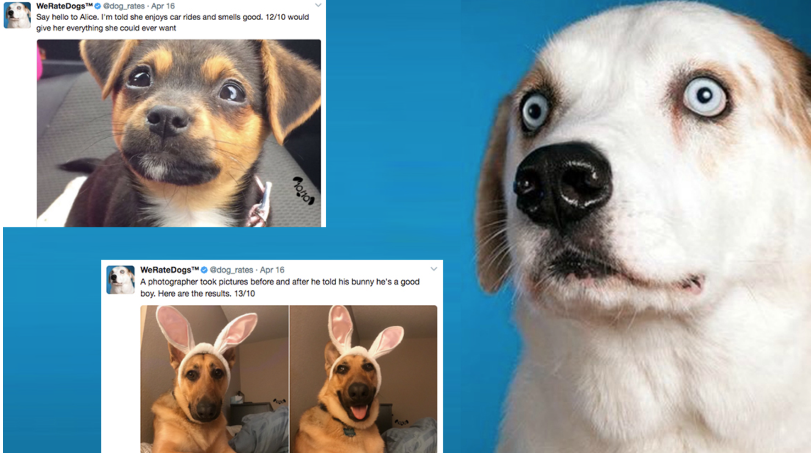

## Udacity Data Analysis Nanodegree

---
## Project 4: Wrangle and Analyze Data
#### Created by: Juanita Smith
#### Last date: 9 February 2023

---


## We rate dogs




## Project Overview

This project was completed as part of the 'Data Analyst' nanodegree with Udacity and focus on the data wrangling process.

The goal of the project was to demonstrate the data wrangling and analysis skills obtained from the course.
The dataset to be wrangled is the tweet archive of Twitter user @dog_rates, also known as WeRateDogs. WeRateDogs is a Twitter account that rates people's dogs with a humorous comment about the dog. Dog owners upload a picture of their dog, writes a funny comment and give their own dog a rating out of 10. Owners almost always give their dogs a rating greater than 10. e.g 11/10, 12/10, 13/10, it's the nature of the website. WeRateDogs has over 4 million followers and has received international media coverage. It's only a bit of fun, and brings great joy when browsing the cutest dog images !
   
Tasks completed for this project:

- Step 1: Data Gathering
- Step 2: Assessing data - focussing on the 'what' using both visual and programming inspection
- Step 3: Cleaning - using the 'define->code->test' framework
- Step 4: Storing Data - cleaned data is stored as csv file
- Step 5: Analysing and Visualization using pandas plotting

## Data

Real-world data rarely comes clean, especially when it comes from the internet where users enter data into free text fields that are optional, as it's the case with this twitter account.

During the data gathering step, twitter data needed to be downloaded **automaticaly** from the internet using a variety of sources and techniques, with the help of Python and its libraries.

3 data gathering strategies was demonstrated:

### 1. Twitter archive - Automated downloaded from an URL

WeRateDogs downloaded their Twitter archive and sent it to Udacity via email exclusively to use in this project. This archive contains basic tweet data (tweet ID, timestamp, text, etc.) for a sample of 2356 tweets with ratings, for a period between Nov 2015 - July 2017.
Data was automatically downloaded from the Udacity website using `pd.read_csv` and passing the URL as input.

### 2. Use twitter API 'tweepy v2' to retrieve additional data

For each tweet in the twitter archive from step 1, the retweet and like count was retrieved as minimum requirement for the project

The latest version of the tweepy API was used to retrieve the data, which offered more flexibility and data availability, although it took some time to figure out how to use it. I initially tried to download data like geo data, country, place, additional metrics etc, as these could make interesting analytics, however this data was never filled.

```python    
            tweet_fields = ["public_metrics", "entities", "text", "attachments","geo"]
            expansions = ['geo.place_id', 'attachments.media_keys']
            media_fields = ['url', 'type']
            place_fields = ['country_code', 'full_name', 'place_type']
            response = client.get_tweets(tweet_id, 
                                         tweet_fields=tweet_fields, 
                                         expansions=expansions,
                                         media_fields=media_fields,
                                         place_fields = place_fields)
```

Each tweet's entire JSON response was dumped to a txt file, each tweet on its own line

The .txt file was read line by line, and the most useful data to be reused was added to a pandas dataframe. Some data kept are already in twitter archive from step 1, however might be useful to compliment missing or corrupt data potentially. Fields that were kept:

- id (same as tweet_id and were use for table joins)
- text (same text as in twitter archive)         
- retweet_count   
- reply_count     
- like_count      
- quote_count     
- media_url (first image of each tweet was again retrieved to compliment otherwise potential missing images in prediction file)    
- media_type (photo, video, etc)     
- short_url (same url as present in archive data text from step 1, however the url here is stored on it's own) 
- expanded_url (same as in twitter archive)   
- annotation (additional data about dog, contains mostly a place, dog name or dog breed, and can be used to complement missing data)     

Some API errors occurred which was dumped to txt log file. Some tweets are no longer availabe in the API.


### 3. Use the Requests library to download the tweet breed predictions (image_predictions.tsv)

Udacity provided a file that used the dog images to predict the breed of the dog.
Each tweet consist of the link to the image that gave the best predictions, 3 predictions, each with it's confidence level and if the prediction is actually a valid dog breed.

This file (image_predictions.tsv), is hosted on Udacity's servers and was downloaded programmatically using the Requests library and the following URL: https://d17h27t6h515a5.cloudfront.net/topher/2017/August/599fd2ad_image-predictions/image-predictions.tsv


### 4. Download dog profile images (optional extra step)

Image urls containing `.jpg` retrieved from API in step 2 was used to download the first dog image for each tweet from the internet, as additional practice. I had in mind for visualization to show a dog profile card of the most liked breeds and dogs.

Images extracted in step 4, will not be published to github due to it's size

## Software Requirements
- You need to be able to work in a Jupyter Notebook 
- Python 3 (Python 3.9 interpreter was used)
- Libraries needed:
    - pandas==1.4.4
    - numpy==1.21.5
    - matplotlib==3.5.2
    - jupyter notebook=1.0.0
    - nb_conda=2.2.1
    - tweepy
    - nb_conda
    - requests
    - json


## Installation

To clone the repository: 'https://github.com/JuanitaSmith/WeRateDogs.git'

To call tweepy API, credentials needs to be obtained from your own twitter account and stored in environment variables, example:

```
# import API credentials from environment variables
consumer_key = os.environ.get('TWITTER_CONSUMER_KEY')
consumer_secret = os.environ.get('TWITTER_CONSUMER_SECRET')
access_token = os.environ.get('TWITTER_ACCESS_TOKEN')
access_secret = os.environ.get('TWITTER_ACCESS_SECRET')
bearer_token = os.environ.get('TWITTER_BEARER_TOKEN')
```

To use tweepy v2, I registered for extended access, see more documentation [here](https://docs.tweepy.org/en/stable/extended_tweets.html)

## Resources used:

- [Font color in headings](https://stackoverflow.com/questions/4182554/html-css-font-color-vs-span-style)
- [Twitter documentation for get_tweets using V2](https://developer.twitter.com/en/docs/twitter-api/tweets/lookup/api-reference/get-tweets-id)
- [Twitter source code example for get_tweets using V2](https://github.com/twitterdev/Twitter-API-v2-sample-code/blob/main/Tweet-Lookup/get_tweets_with_bearer_token.py)
- [reading a json file](https://knowledge.udacity.com/questions/66949#66975)
- [Twitter API v2, tweepy and pandas in Python](https://www.kirenz.com/post/2021-12-10-twitter-api-v2-tweepy-and-pandas-in-python/twitter-api-v2-tweepy-and-pandas-in-python/)
- [How to handle dog stages](https://knowledge.udacity.com/questions/196883)
- [prevent exponential format when plotting](https://stackoverflow.com/questions/14711655/how-to-prevent-numbers-being-changed-to-exponential-form-in-a-plot)
- [How to display images and text together using HTML](https://stackoverflow.com/questions/25698448/how-to-embed-html-into-ipython-output)